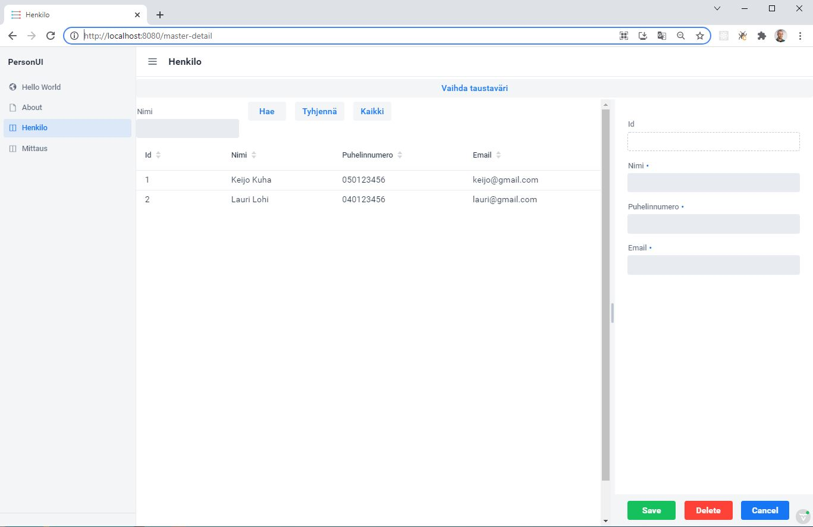
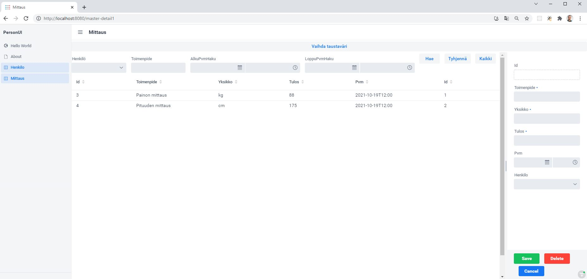

# PersonUI

Ohjelman kuvaus: REST-tyylinen web-api, joka käsittelee kahden taulun tietokantaa. 
Sovelluksessa on backend-toiminnot ja niihin liittyvä web-frontend. 
Tietokanta sisältää henkilöiden tietoja sekä henkilöihin liittyviä mittaustuloksia kuten 
verenpaine, paino ym. Tietokannassa on taulujen välillä relaatio, 
jotta henkilöön liittyvät mittaukset ovat helposti saatavilla.

Tämä projekti on aloitettu luomalla ensin Vaadin -sovellus https://start.vaadin.com/app/ . 
Vaadin-projektin luonnin jälkeen koodaus on tehty Spring Boot Suite 4-ohjelmistolla. 
Ennen ohjelman ajoa Run Configuration:ssa asetetaan ajettava Application. 
Spring Boot App/New launch configuration Name: PersonUI 
(Spring Boot: Project:personui Main type: Application). 
Nyt ohjelma käynnistyy Run PersonUI ja avautuu http://localhost:8080 .

## Running the application

The project is a standard Maven project. To run it from the command line,
type `mvnw` (Windows), or `./mvnw` (Mac & Linux), then open
http://localhost:8080 in your browser.

You can also import the project to your IDE of choice as you would with any
Maven project. Read more on [how to set up a development environment for
Vaadin projects](https://vaadin.com/docs/latest/guide/install) (Windows, Linux, macOS).

## Deploying to Production

To create a production build, call `mvnw clean package -Pproduction` (Windows),
or `./mvnw clean package -Pproduction` (Mac & Linux).
This will build a JAR file with all the dependencies and front-end resources,
ready to be deployed. The file can be found in the `target` folder after the build completes.

Once the JAR file is built, you can run it using
`java -jar target/personui-1.0-SNAPSHOT.jar`

## Project structure

- `MainView.java` in `src/main/java` contains the navigation setup (i.e., the
  side/top bar and the main menu). This setup uses
  [App Layout](https://vaadin.com/components/vaadin-app-layout).
- `views` package in `src/main/java` contains the server-side Java views of your application.
- `views` folder in `frontend/` contains the client-side JavaScript views of your application.
- `themes` folder in `frontend/` contains the custom CSS styles.

## Useful links

- Read the documentation at [vaadin.com/docs](https://vaadin.com/docs).
- Follow the tutorials at [vaadin.com/tutorials](https://vaadin.com/tutorials).
- Watch training videos and get certified at [vaadin.com/learn/training](https://vaadin.com/learn/training).
- Create new projects at [start.vaadin.com](https://start.vaadin.com/).
- Search UI components and their usage examples at [vaadin.com/components](https://vaadin.com/components).
- Discover Vaadin's set of CSS utility classes that enable building any UI without custom CSS in the [docs](https://vaadin.com/docs/latest/ds/foundation/utility-classes). 
- Find a collection of solutions to common use cases in [Vaadin Cookbook](https://cookbook.vaadin.com/).
- Find Add-ons at [vaadin.com/directory](https://vaadin.com/directory).
- Ask questions on [Stack Overflow](https://stackoverflow.com/questions/tagged/vaadin) or join our [Discord channel](https://discord.gg/MYFq5RTbBn).
- Report issues, create pull requests in [GitHub](https://github.com/vaadin/platform).
"# VaadinJavaUI" 
